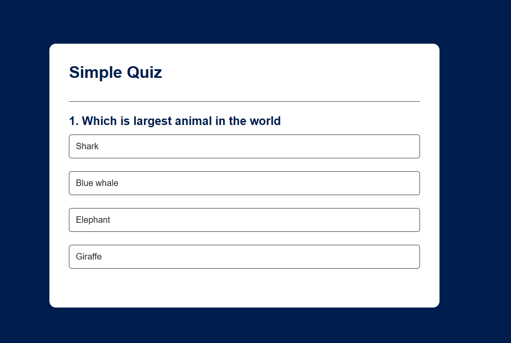
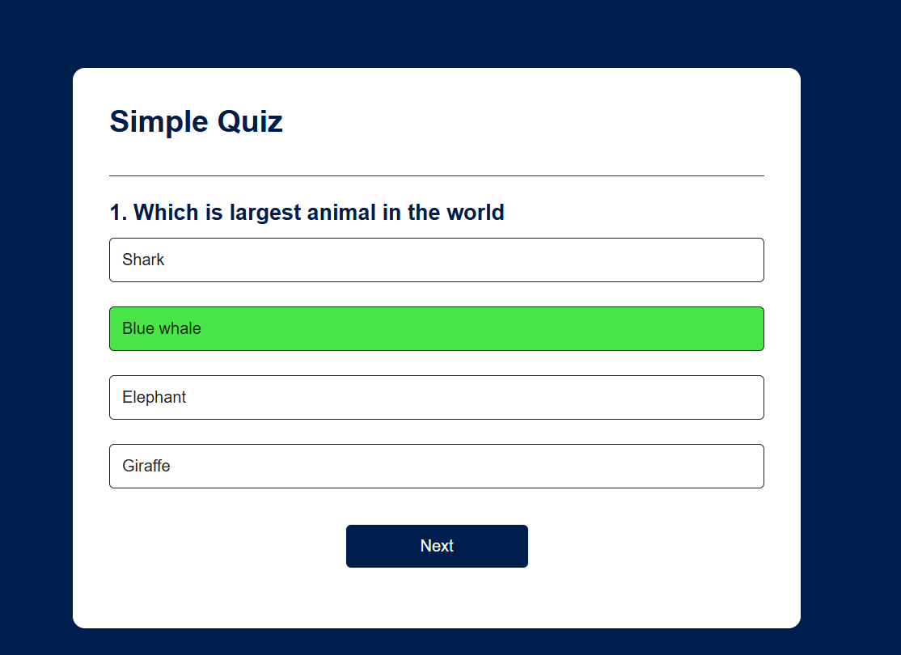
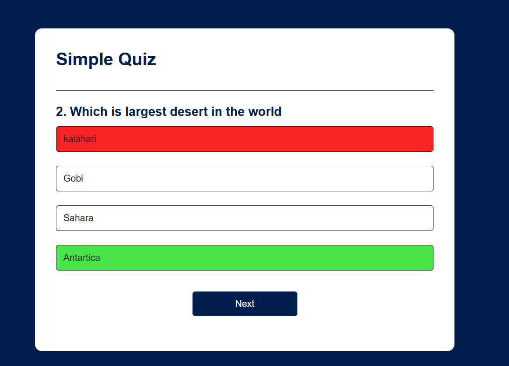

# 📝 To-Do List App

A simple, responsive **To-Do List App** built with HTML, CSS, and JavaScript.  
This app allows you to **add tasks**, **mark them as completed**, and **delete tasks** with a clean and user-friendly interface.  
**Built with:** HTML, CSS, and JavaScript.

---

## 🚀 Features
- ➕ Add new tasks easily
- ✅ Mark tasks as complete
- ❌ Delete unwanted tasks
- 📱 Responsive design
- 💾 Local storage support

---

## 📸 Screenshots

<p align="center">
  
  
  
</p>

---

## 🛠️ Technologies Used
- **HTML5** – Structure
- **CSS3** – Styling & layout
- **JavaScript** – Functionality

---

## 📂 How to Use
1. Clone this repository:
   ```bash
   git clone https://github.com/YOUR_USERNAME/To-Do-List-App.git

2.Navigate to the project folder:
   ```bash
   cd To-Do-List-App ```

3.Open index.html in your browser.

